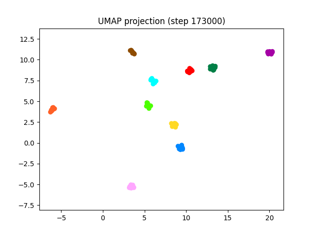
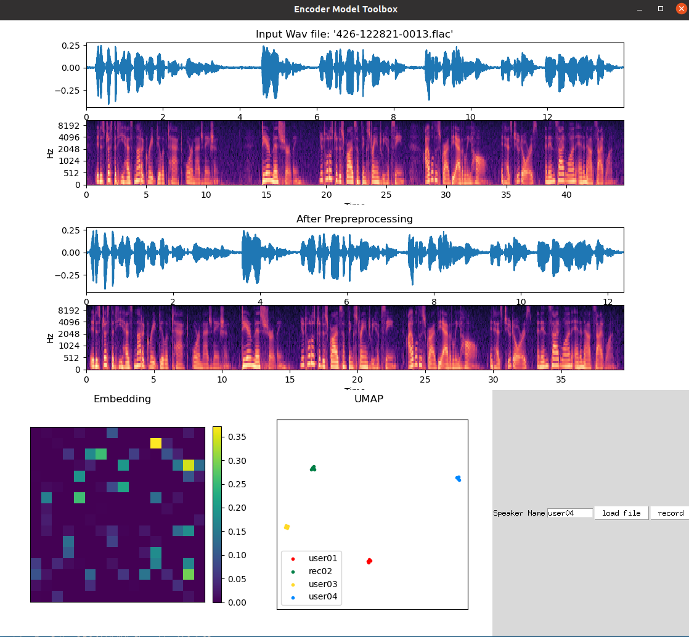

# ECE6123_Project_VoiceEncoder 
This repo is the course project for ECE6123. See the pdf file for full report.

## Model, Data Preprocessing and Training
This part of code and implementation is the encoder part of the project [Real-Time-Voice-Cloning](https://github.com/CorentinJ/Real-Time-Voice-Cloning), including the preprocessing and training scripts.
Based on the scripts, we trained our own encoder model in './encoder/saved_models/my_run.pt' for 173,001 steps. The result performance can be visualized from the UMAP projection of 10 speakers (10 utterances each):

## GUI
We also write our own GUI tool to visualized the model's output in gui.py.

The GUI allows you to load or record an utterance and will show the preprocessing process and the output embedding of the model. Besides, it will also plot the UMAP projection of historical input data.